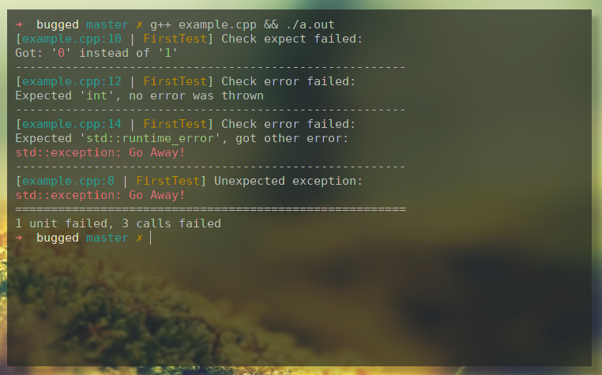

Bugged
======

Your code is bugged? Your functions try hard to fight their interfaces and documentation?
Your exceptions multiply at the rate of rabbits and you are lost in all of it? <br>
__Good news! You don't need a >20k-loc framework to fight back!__

Just a single header for modern C++ unit testing. <br>
Released into the public domain to spare you from any additional license headaches. <br>
Does not perform any macro and template magic that itself provides a nice habitat for those
little beasts. Does only what it has to. And this well.
You don't need any magic to exterminate bugs.
(Requires C++11 though since it got way better flamethrowers than the old and boring stuff).

__Use these 3 weapons instead:__

```cpp
TEST(<test function name>) { <tests> } // function will be automatically called
EXPECT(<expression>, <expected>); // checks if expressions evaluates to expected
ERROR(<expression>, <expected error>); // checks if expression throws the expected error
```

### Example:

```cpp
#include "bugged.hpp"
#include <stdexcept>

int returns0() { return 0; }
void throws() { throw std::logic_error("Go Away!"); }

// declare a test method
TEST(FirstTest) {
	EXPECT(returns0(), 0); // will succeed
	EXPECT(returns0(), 1); // will fail

	ERROR(returns0(), int); // will fail
	ERROR(throws(), std::logic_error); // will succeed
	ERROR(throws(), std::runtime_error); // will fail

	throws(); // will end the test and output the exception.
}

// empty tests or ones only with static_asserts or other checks are ok as well
TEST(EmptyTest) {}
```

The output of the test above could look like this:


__Contributions of all kind are welcome!__
